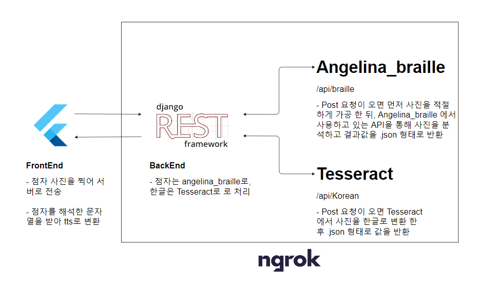
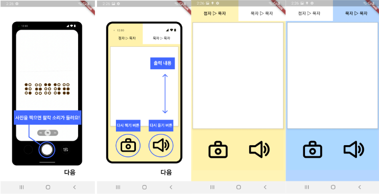

## Keimyung university Capston Design Backend part

해당 프로젝트는 계명대학교 캡스톤 디자인 작품입니다. 한국어 점사 사진을 찍으면 번역하여 문자열로 바꿔주는 것과, 영어나 한국어를 찍으면 Tesserect을 통해서 영어, 한국어 문자열로 변환해주는
API을 개발하는 것을 목표로 개발하였습니다. 

This project is keimyung university capston design project. It is designed for the visually impaired. It works by taking a braille picture and translating the picture into tts


## Quick Start
- OS : window 11
- python version : 3.10.2
- git

가상 환경을 설정하고, 관련 패키지 설치후 서버를 작동 합니다. <br>
make python virtual environment and install python module

```
py -3.10 -m venv Env
source Env/Scripts/Activate

# windows
sh sh_files/win_dev.sh

# macos
sh sh_files/mac_dev.sh
```

run server
```
python backend/manage.py runserver 
```

## Stack

- Django
- Django rest framework
- Tesseract


## Arcitecture



## Design


## Play


## Improvements
- 원래는 HTTP 메소드 Post, Get 2개를 두고 DB을 연동하여 자주 찍히는 점자나 사용자 데이터 등을 수집하는 기능을 만들려고 했으나, 조원이 Flutter 다루는게 익숙치 않고, 교수님도 별로 원치 않은 것 같아서 보류하였습니다.
  
  Originally, we were going to create a function to collect braille or user data that is often taken by connecting to a DB with two HTTP methods,  but we put it on hold because the capston member was not familiar with Flutter and the professor did not seem to want it.

- CNN 모델을 직접 개발해봤으나 성능이 생각보다 잘 나오지 않아서 다른 곳에서 제공하는 API을 사용하여 점자 번역을 처리하였습니다. 

  I tried developing my own CNN model, but it didn't perform as well as I had hoped, so I used an API provided by another company to handle Braille translation.

## History

- 유니코드 점자를 한글로 변환해주는 translate.py 알고리즘을 개발하였습니다. 
  
  Develop python source code translating Algorithm Unicode Braille chars to Korean (22.11.08) <br>

- 프로토 타입 개발을 위해서 selenium을 활용하여 점자 코드를 변환하도록 설정하였습니다. 
 
  Set to make pictures into braille through selenium (22.11.24)

- 좋은 대체제인 BrailleTokorean, Angelina-reader CNN API을 찾아서 translate.py와 selenium 코드를 삭제 하였습니다.

  Remove Algorithm Unicode Braille chars to Korean, selenium code to use BrailleToKorean Packages, Angelina-reader CNN models (23.05.15)

- Flutter을 다루는 조원이 POST, GET을 처리하는 부분이 힘들다고 하여 http method인 POST만 보내면 json 형태의 문자열 값을 반환 하도록 코드를 수정하였습니다.
  
  A Flutter developer told me that it was difficult to handle POST and GET, so I modified the code to return a string value in json format by sending only the http method, POST.(23.05.20)
  

## Reference
- Algorithm Unicode Braille chars to Korean : Pypi BrailleToKorean package <br>
- pictures into braille CNN models : https://angelina-reader.ru/


## Etc
- Naver_Blog : https://blog.naver.com/j3heawon